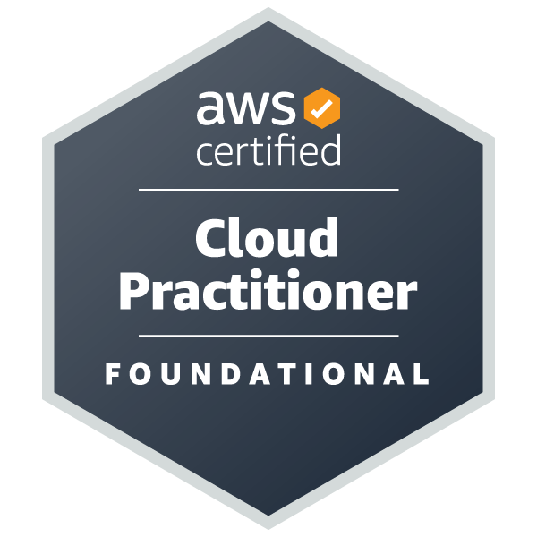
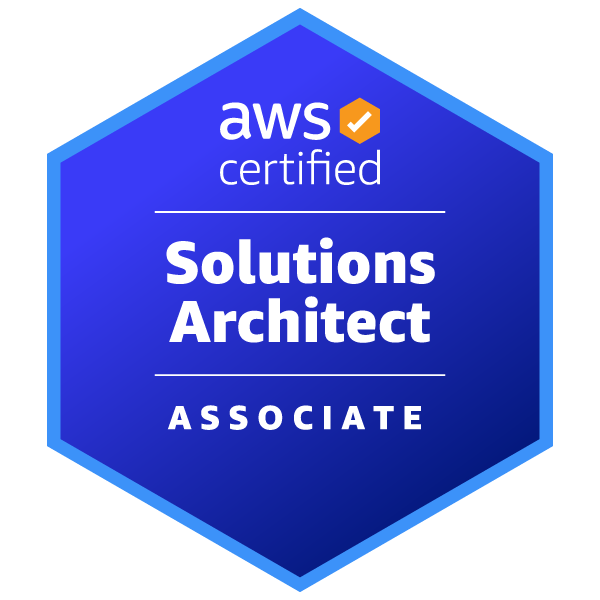

  

 

<table>
<tr>
<td width="55%" valign="top">

### Luiz Henrique Souza Egito

Senior Data Scientist focused on data and productivity solutions with **AWS**, **IaC**, and **MLOps**.

Economist / Mathematician at USP (University of São Paulo).

**Experience**

**Senior Data Scientist @ Itaú** *(2026 - Present)*  
Have been building and deploying credit risk models and scalable data pipelines supporting large-scale retail credit decisioning.
Driving risk-return optimization through advanced analytics, model governance, and production-grade ML systems.

**Pleno Data Scientist @ Itaú** *(2025 - 2026)*  
Developed and deployed credit risk models, driving data-informed decisions and improving portfolio performance.
Built scalable data solutions supporting model training, validation, and monitoring.

**Junior Data Scientist @ Itaú** *(2022 - 2025)*
Built NLP-based legal models and deployed solutions on AWS, including AI agents for document analysis and response automation.
Automated workflows and improved efficiency in legal data processing.

**Data Science Intern @ Itaú** *(2021 - 2022)*
Developed classification and regression models to predict legal case outcomes and financial exposure.
Supported data preparation, feature engineering, and model evaluation.

**2026 Goals**
- Achieve foundational certifications in Azure and Google Cloud Platform (GCP)
- Earn AWS Certified Data Engineering (DEA-C01)
- Develop strong knowledge in software architecture
- Build expertise in cloud-based AI solutions
- Gain hands-on experience with agent-based systems

</td>
<td width="45%" valign="top" align="center">

  
  

</td>
</tr>
</table>

---

 My Favorite Tools and Technologies

 

<table align="center">
  <tr>
    <td align="center" width="75">
      
       <strong>Python</strong>
    </td>
    <td align="center" width="75">
      
       <strong>AWS</strong>
    </td>
    <td align="center" width="75">
      
       <strong>Docker</strong>
    </td>
    <td align="center" width="75">
      
       <strong>Kubernetes</strong>
    </td>
    <td align="center" width="75">
      
       <strong>Rust</strong>
    </td>
    <td align="center" width="75">
      
       <strong>PostgreSQL</strong>
    </td>
    <td align="center" width="75">
      
       <strong>GitHub</strong>
    </td>
  </tr>
  <tr>
    <td align="center" width="75">
      
       <strong>Terraform</strong>
    </td>
    <td align="center" width="75">
      
       <strong>Linux</strong>
    </td>
    <td align="center" width="75">
      
       <strong>Bash</strong>
    </td>
    <td align="center" width="75">
      
       <strong>Git</strong>
    </td>
    <td align="center" width="75">
      
       <strong>PyTorch</strong>
    </td>
    <td align="center" width="75">
      
       <strong>VS Code</strong>
    </td>
    <td align="center" width="75">
      
       <strong>Golang</strong>
    </td>
  </tr>
</table>

 
 

---
 

 Certifications & Qualifications

 

<table>
<tr>

<td width="33%" align="center" valign="top">

  
<strong>AWS</strong> 
AWS Certified Cloud Practitioner
</td>

<td width="33%" align="center" valign="top">

  
<strong>AWS</strong> 
AWS Certified Solutions Architect – Associate
</td>

<td width="33%" align="center" valign="top">

  
<strong>ANBIMA</strong> 
CPA-20 Certification
</td>

</tr>
</table>

  

 

 
